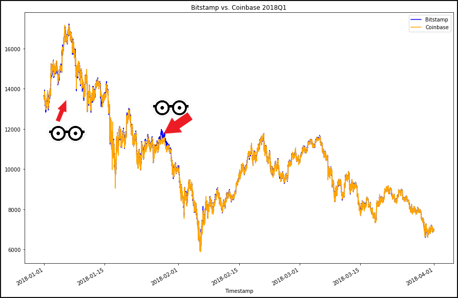

# Challenge_3: Analyzing Bitcoin Exchange Rates
UNCC Online FinTech Bootcamp Module 3 Challenge, due by 11:59pm 12/19/2021

  
https://courses.bootcampspot.com/courses/980/files/1032135

### This Challenge consists of the following steps:

   1. Create a GitHub repository.
   2. Collect the data from `bitstamp.csv` and `coinbase.csv` files in the Resources folder.
   3. Prepare the data.
   4. Analyze the data.
   5. Create an analysis report.
    
---

### Background

In this Challenge, we'll consider arbitrage opportunities in Bitcoin between two different Bitcoin exchanges (Bitstamp and Coinbase). We'll start by sorting through historical trade data for Bitcoin on the two exchanges and apply the three phases of financial analysis: collect the data; prepare the data; and analyze the data.

---

### What's Being Created

We’ll create a Jupyter notebook that contains the code for the data collection, preparation, and analysis, including any visualizations. Within the same notebook file, we will use comments and text to document our analysis, including the answers to the questions in the Challenge instructions. We will make this report clear and concise, understanding that it could be presented to the executive decision maker (who may or may not have experience with the coding that is used to create the Bitcoin analysis).

To accomplish these tasks, we'll:

 - Collect CSV data in a Jupyter notebook file.
 - Prepare the datasets for analysis by cleaning missing and erroneous data.
 - Analyze the data at a high level through summary statistics and visualizations, and use this information to select areas for deeper analysis. Specifically, we’ll select time periods in which to identify arbitrage opportunities.
 
 ---

### Technologies

This application is written in Python 3.7.

Python libraries used:
- Pathlib: [https://docs.python.org/3.7/library/pathlib.html](https://docs.python.org/3.7/library/pathlib.html)  
  Pathlib is a library that enables consistent input and output of files from the main app. 
 - Pandas: [https://pandas.pydata.org/pandas-docs/stable/](https://pandas.pydata.org/pandas-docs/stable/)  
 Pandas is is an open source, BSD-licensed library providing high-performance, easy-to-use data structures and data analysis tools for the Python programming language.

### Installation Guide

prior to running these libraries, install them from the command line:  
  - pandas: `conda install pandas` or `pip install pandas`  
  - pathlib: `pip install pathlib`
---
### Usage

By examining different slices of time during the 3-month period, we can observe more opportunities for profitable trades exist early on and fizzle out over time. The stronger opportunities are seen as areas on the graph where the blue line is peeking out from behind the orange line.

---
### Contributors

Geoff Tarleton - jobeycat@protonmail.com

adapted from Starter Code supplied by UNCC FinTech Online Bootcamp by Trilogy Educational Services, a 2U, Inc. brand.

---

### License

MIT